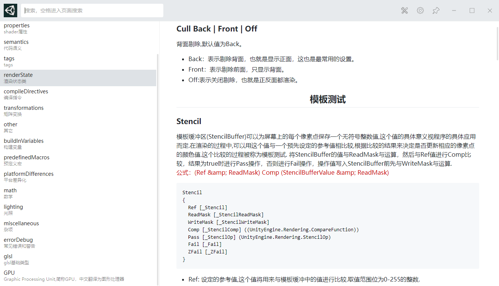

#utools-unity-shader-plugin

## unity shader 手册大全utools插件

### v1.0.1
1. 增加详细搜索功能
### v1.0.0
1. 增加shader语法内容
2. 实现一级搜索功能

基本上unity shader的语法都在这里。
源码:[https://github.com/jimhy/utools-unity-shader-plugin](https://github.com/jimhy/utools-unity-shader-plugin)